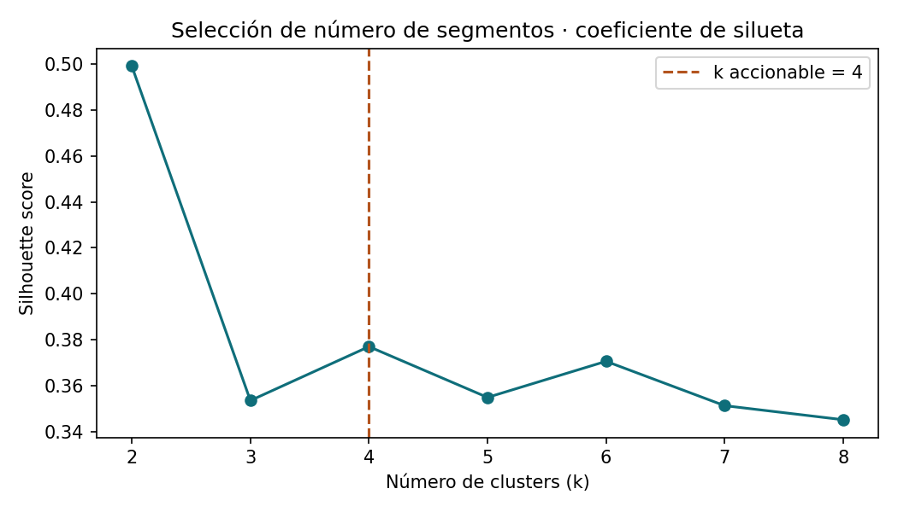
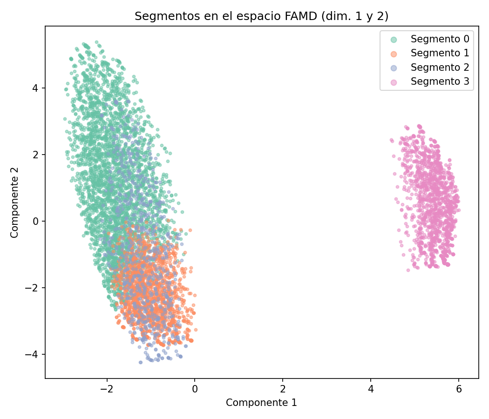
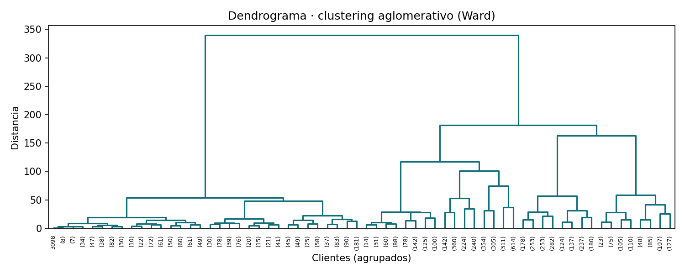
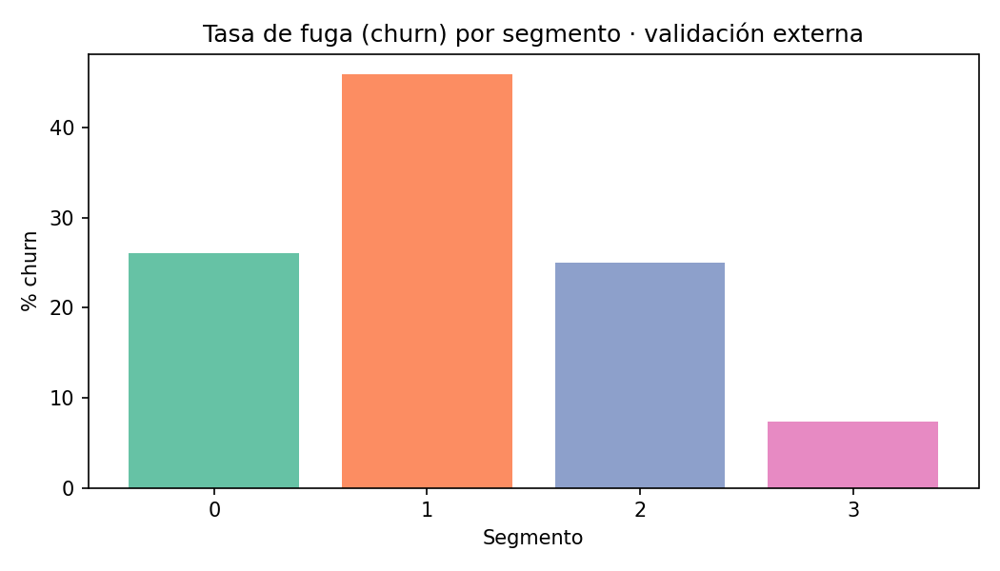

# Segmentación de clientes con FAMD + clustering aglomerativo

Segmentación **no supervisada** de una base de clientes con **datos mixtos**
(variables numéricas y categóricas), usando **FAMD** (*Factor Analysis of Mixed
Data*) para reducir dimensionalidad y **clustering aglomerativo (Ward)** para
agrupar. El objetivo es convertir una base plana de clientes en **segmentos
accionables** para estrategias diferenciadas.

> Réplica, sobre datos públicos, de la metodología que aplico en proyectos
> reales de segmentación empresarial: cuando los datos combinan variables
> numéricas y categóricas, FAMD permite tratarlas de forma conjunta sin
> forzar codificaciones que distorsionan la geometría del problema.

---

## El problema

Las técnicas clásicas de clustering (K-Means) asumen variables numéricas y
distancias euclídeas, lo que obliga a codificar las categóricas con *one-hot*
y termina distorsionando las distancias. **FAMD** resuelve esto: proyecta
numéricas y categóricas en un mismo espacio factorial, y sobre esas
coordenadas se aplica el clustering.

**Datos:** [IBM Telco Customer Churn](https://www.kaggle.com/datasets/blastchar/telco-customer-churn)
— 7.032 clientes, 19 variables (numéricas: antigüedad, cargos; categóricas:
tipo de contrato, servicios contratados, método de pago, etc.).
La variable de fuga (*churn*) **no entra al modelo**: se reserva como
**validación externa** de los segmentos.

## Metodología

1. **Limpieza** — conversión de tipos, manejo de nulos, reclasificación de
   variables binarias como categóricas.
2. **FAMD** — reducción a 5 componentes que combinan información numérica y
   categórica.
3. **Selección de k** — coeficiente de silueta para `k = 2…8`. El máximo cae
   en `k = 2` (una división trivial grande/pequeña, poco accionable), por lo
   que se elige el **mejor `k` accionable (`k = 4`)**, que equilibra cohesión
   y granularidad útil para negocio.
4. **Clustering aglomerativo (Ward)** sobre las coordenadas FAMD.
5. **Perfilado** cualitativo de cada segmento + validación con la tasa de fuga.

## Resultados

Los 4 segmentos tienen perfiles claramente distintos, y la **tasa de fuga
varía de 7,4% a 45,9%** entre ellos —aunque *churn* nunca entró al modelo—,
lo que confirma que la segmentación captura comportamiento real de negocio.

| Segmento | % base | Antigüedad (mediana) | Cargo mensual | Contrato | Internet | **Churn** |
|---|---|---|---|---|---|---|
| **0 · Establecidos de alto valor** | 45,3% | 48 meses | $91 | Mes a mes | Fibra | 26,1% |
| **1 · Nuevos de alto gasto en riesgo** | 23,4% | 6 meses | $70 | Mes a mes | Fibra | **45,9%** |
| **2 · DSL de gasto medio** | 9,7% | 29 meses | $41 | Mes a mes | DSL | 25,0% |
| **3 · Leales de bajo gasto** | 21,6% | 25 meses | $20 | 2 años | Sin internet | **7,4%** |

**Lectura de negocio:** el **Segmento 1** (clientes nuevos, de alto gasto en
fibra y contrato mes a mes) concentra casi la mitad de la fuga → es el foco
natural de una estrategia de **retención temprana**. El **Segmento 3** (contrato
a 2 años, bajo gasto) es el más fiel y estable.

| Selección de k | Segmentos en espacio FAMD |
|---|---|
|  |  |

| Dendrograma (Ward) | Validación: churn por segmento |
|---|---|
|  |  |

## Cómo ejecutarlo

```bash
# 1. Crear entorno e instalar dependencias
python3 -m venv .venv
source .venv/bin/activate
pip install -r requirements.txt

# 2. Ejecutar el análisis (genera figuras/ y resultados/)
python segmentacion.py
```

> El dataset ya está incluido en `data/`. El script regenera todas las
> figuras y el perfil de segmentos de forma reproducible (`random_state=42`).

## Stack

`Python` · `pandas` · `scikit-learn` (AgglomerativeClustering) ·
`prince` (FAMD) · `scipy` (dendrograma) · `matplotlib`

## Estructura

```
segmentacion-clientes-famd/
├── segmentacion.py          # pipeline completo
├── data/                    # dataset público
├── figuras/                 # gráficos generados
├── resultados/              # perfil de segmentos (csv + md)
└── requirements.txt
```

---

**Laura Gallego Vélez** — Científica / Analista de Datos
[LinkedIn](https://www.linkedin.com/in/laura-gallego-v%C3%A9lez-445285138/)
